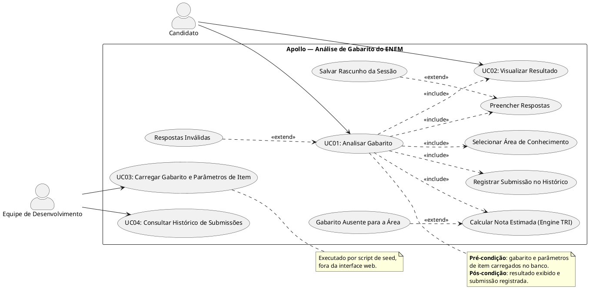

## Casos de Uso

Os casos de uso do projeto Apollo derivam dos requisitos funcionais consolidados em <a href="levreq.md">levreq.md</a>. O escopo desta versão é restrito: não há cadastro, autenticação, recuperação de senha nem perfis de usuário — a análise do gabarito é anônima e imediata.

### Descrição

- Análise de gabarito (candidato)
	- Selecionar área de conhecimento
	- Preencher respostas
	- Salvar rascunho da sessão
	- Submeter respostas para análise
	- Visualizar resultado

- Administração (equipe de desenvolvimento)
	- Carregar gabarito e parâmetros de item
	- Consultar gabaritos cadastrados
	- Consultar histórico de submissões

### Diagrama de Casos de Uso

### UC01 — Analisar gabarito

* Atores:

	- Candidato
	- Sistema Apollo

- Pré-Condições:
	- O gabarito e os parâmetros de item da área selecionada estão carregados no banco relacional (UC03 executado).

* Fluxo Básico:
    1. Candidato acessa o formulário web distribuído pelo CloudFront
    2. Candidato seleciona a área de conhecimento (LC, CH, CN ou MT)
    3. Sistema apresenta os campos das 45 questões da área selecionada
    4. Candidato preenche as respostas, marcando alternativas de A a E ou deixando questões em branco
    5. Sistema registra o rascunho como sessão temporária, com expiração automática em 30 minutos
    6. Candidato submete as respostas
    7. Sistema valida a área informada e a quantidade de respostas recebidas
    8. Sistema recupera o gabarito e os parâmetros de item da área no banco relacional
    9. Sistema executa a engine TRI e obtém a nota estimada
    10. Sistema apura acertos, erros e questões em branco e identifica as questões erradas
    11. Sistema registra a submissão no histórico
    12. Sistema retorna o resultado ao formulário

- Fluxos Alternativos:
	- 7a. Área não informada ou quantidade de respostas diferente de 45
		- 7a1. Sistema retorna erro com código HTTP 400 e mensagem descritiva, sem expor detalhes internos
	- 8a. Gabarito ou parâmetros de item ausentes para a área solicitada
		- 8a1. Sistema não executa a análise e informa a indisponibilidade ao candidato
		- 8a2. Equipe executa o script de seed para regularizar os dados (UC03)
	- 8b. Falha de comunicação com o banco de dados
		- 8b1. Sistema retorna erro com código HTTP 500 e mensagem genérica
		- 8b2. Evento é registrado no CloudWatch Logs e contabilizado no alarme de taxa de erro
	- 5a. Sessão temporária expira antes da submissão
		- 5a1. Rascunho é removido automaticamente pelo TTL e o candidato preenche novamente o formulário

- Pós-Condições:
	- Resultado exibido ao candidato
	- Submissão registrada no histórico

### UC02 — Visualizar resultado

- Atores:
	- Candidato
	- Sistema Apollo

- Pré-Condições:
	- Análise executada com sucesso pela função de análise (passos 7 a 11 do UC01)

- Fluxo Básico:
	- 1. Sistema apresenta a nota estimada da área analisada
	- 2. Sistema apresenta as contagens de acertos, erros e questões em branco
	- 3. Sistema lista as questões erradas com a alternativa marcada e a resposta correta

- Fluxos Alternativos:
	- 1a. Análise não concluída por erro
		- 1a1. Sistema exibe mensagem de erro compreensível, sem jargão técnico e sem detalhes de infraestrutura

- Pós-Condições:
	- Candidato tem acesso à estimativa e ao detalhamento das questões erradas

### UC03 — Carregar gabarito e parâmetros de item

- Atores:
	- Equipe de desenvolvimento
	- Sistema Apollo

- Pré-Condições:
	- Infraestrutura provisionada por `cdk deploy`
	- Gabarito oficial e parâmetros de item obtidos junto ao INEP

- Fluxo Básico:
	- 1. Equipe executa o script de seed
	- 2. Sistema recupera a credencial do banco no AWS Secrets Manager
	- 3. Sistema insere as questões das quatro áreas, com a resposta correta e os parâmetros de item de cada questão
	- 4. Equipe verifica a carga consultando os gabaritos pela API administrativa

- Fluxos Alternativos:
	- 2a. Credencial indisponível ou sem permissão de leitura
		- 2a1. Script encerra com erro e a equipe corrige a política IAM ou o segredo
	- 3a. Registro já existente para a mesma área e questão
		- 3a1. Sistema mantém a consistência do gabarito sem duplicar questões

- Pós-Condições:
	- Gabarito e parâmetros de item disponíveis para a análise (UC01)

### UC04 — Consultar histórico de submissões

- Atores:
	- Equipe de desenvolvimento
	- Sistema Apollo

- Pré-Condições:
	- API administrativa Django em execução na instância EC2
	- Ao menos uma submissão registrada

- Fluxo Básico:
	- 1. Equipe requisita o histórico à API administrativa
	- 2. Sistema consulta as submissões registradas no banco relacional
	- 3. Sistema retorna a relação de submissões com área, data e resultado apurado

- Fluxos Alternativos:
	- 2a. Falha de comunicação com o banco
		- 2a1. Sistema retorna erro com código HTTP 500 e registra o evento no CloudWatch Logs

- Pós-Condições:
	- Equipe dispõe dos dados de acompanhamento do uso do sistema

## Versionamento

| Data | Versão | Descrição | Autor(es) |
| -- | -- | -- | -- |
| 2026 | 1.0 | Casos de uso derivados dos requisitos funcionais do projeto Apollo. | Equipe Apollo (`<a definir>`) |
