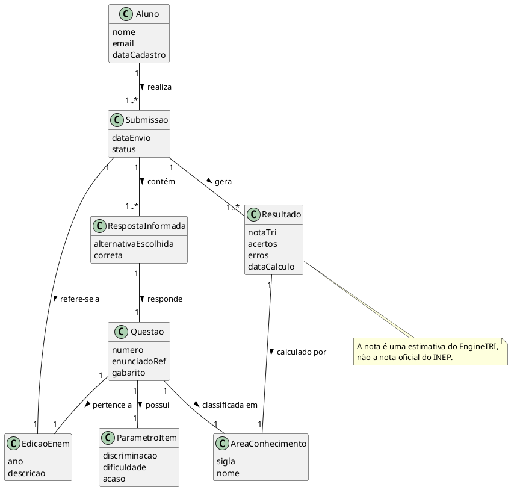
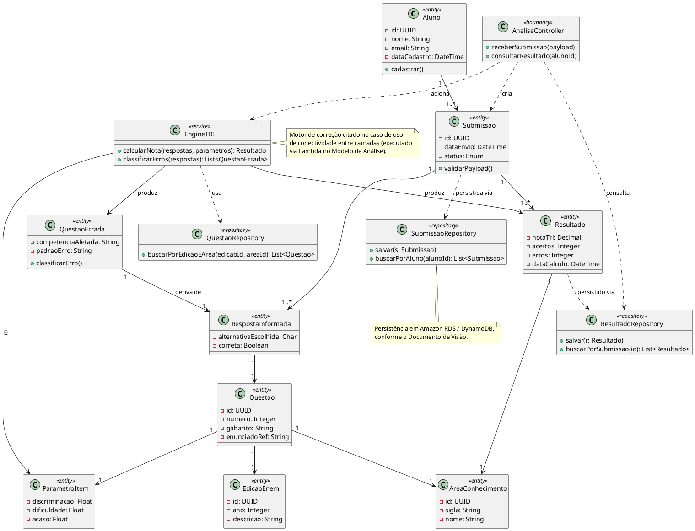

## Diagrama de Classes

### Objetivo

O Diagrama de Classes é uma representação visual das classes, seus atributos, métodos e os relacionamentos entre elas. Ele é fundamental para a modelagem orientada a objetos e serve como base para a implementação do sistema.

### Componentes do Diagrama de Classes

Este documento apresenta, para o projeto Apollo:

1. **Diagrama de Classes Conceitual** (visão de domínio).
2. **Diagrama de Classes de Especificação** (visão de projeto).

Ambos cobrem o fluxo central do produto: um aluno envia as respostas de uma prova do ENEM, o sistema corrige automaticamente e calcula a nota estimada por área de conhecimento via Teoria de Resposta ao Item (TRI) — a mesma metodologia usada pelo INEP.

Foram derivados de:

- Documento de Visão — Projeto Apollo (v1.0);
- Documento de Requisitos Suplementares — Projeto Apollo (v1.0);
- Casos de Uso Arquiteturais — Projeto Apollo (v1.0);
- Modelo de Análise (Pacotes/Subsistemas) — Projeto Apollo (v1.0).

### 1) Diagrama de Classes Conceitual

#### 1.1 Finalidade

Representar as entidades de negócio do Apollo e seus relacionamentos, sem estereótipos técnicos nem tipos de dado — nível adequado para validar o modelo com o professor antes de avançar à especificação.

#### 1.2 Descrição das classes

| Classe | Descrição |
|---|---|
| `Aluno` | Estudante cadastrado na plataforma, que realiza uma ou mais submissões. |
| `EdicaoEnem` | Uma edição do ENEM (ano), à qual pertencem as questões usadas na correção. |
| `AreaConhecimento` | Uma das quatro áreas do ENEM (Linguagens, Ciências Humanas, Ciências da Natureza, Matemática). |
| `Questao` | Uma questão de uma edição/área específica, com gabarito e referência ao enunciado. |
| `ParametroItem` | Parâmetros estatísticos da questão (discriminação, dificuldade, acaso) usados pelo motor de cálculo da nota TRI. |
| `Submissao` | O envio de um conjunto de respostas de um aluno para uma edição do ENEM. |
| `RespostaInformada` | A resposta do aluno a uma questão específica dentro de uma submissão. |
| `Resultado` | A nota TRI calculada por área de conhecimento para uma submissão, com contagem de acertos/erros. |

#### 1.3 Modelo conceitual

### 2) Diagrama de Classes de Especificação

#### 2.1 Objetivo

Refinar o modelo conceitual para uma estrutura orientada à implementação, adicionando tipos de atributo, assinaturas de métodos e estereótipos UML (`<<entity>>`, `<<service>>`, `<<boundary>>`, `<<repository>>`).

#### 2.2 Classes adicionais da especificação

| Classe | Estereótipo | Responsabilidade |
|---|---|---|
| `QuestaoErrada` | `<<entity>>` | Erro classificado por competência, usado para montar o dashboard de áreas a melhorar do aluno. |
| `EngineTRI` | `<<service>>` | Calcula a nota TRI a partir das respostas e dos parâmetros de item, e classifica os erros por competência. |
| `AnaliseController` | `<<boundary>>` | Ponto de entrada da API: recebe a submissão do aluno e expõe a consulta de resultado. |
| `SubmissaoRepository` | `<<repository>>` | Persistência e busca de submissões. |
| `ResultadoRepository` | `<<repository>>` | Persistência e busca de resultados calculados. |
| `QuestaoRepository` | `<<repository>>` | Busca de questões por edição e área de conhecimento. |

#### 2.3 Diagrama de especificação

### 3) Matriz de Rastreabilidade

| Classe | Origem/Referência |
|---|---|
| `Aluno` | Documento de Visão — Stakeholders e Usuários (Aluno). |
| `Submissao` / `RespostaInformada` | Documento de Visão — Principais Funcionalidades (envio do gabarito); Caso de Uso Arquitetural de Conectividade entre Camadas. |
| `Questao` / `EdicaoEnem` / `AreaConhecimento` / `ParametroItem` | Documento de Visão — Introdução/Escopo (provas do ENEM 2019+); dados de origem do INEP. |
| `Resultado` / `QuestaoErrada` | Documento de Visão — Principais Funcionalidades (dashboard de erros e nota TRI). |
| `EngineTRI` | Caso de Uso Arquitetural de Conectividade entre Camadas (motor de correção via Lambda); Modelo de Análise — pacote Monitoring & Detection. |
| `AnaliseController` | Caso de Uso Arquitetural de Conectividade entre Camadas (API Gateway como ponto de recebimento). |
| `SubmissaoRepository` / `ResultadoRepository` / `QuestaoRepository` | Modelo de Análise — RDS e DynamoDB como camadas de persistência. |

### 4) Estrutura de versionamento e revisão

- **Versão**: `v1.0`
- **Data**: 23/09/2026
- **Autor(es)**: Equipe do Projeto Apollo
- **Revisor(es)**: `<a definir>`
- **Resumo da alteração**: modelagem conceitual e de especificação do domínio completo do Apollo, com rastreabilidade aos demais artefatos RUP/UP e relação explícita com o recorte reduzido do `apollo_eb`.

### 5) Entregáveis

- Diagrama de Classes Conceitual (fonte PlantUML incorporada nesta página);
- Diagrama de Classes de Especificação (fonte PlantUML incorporada nesta página);
- Matriz de rastreabilidade preenchida;
