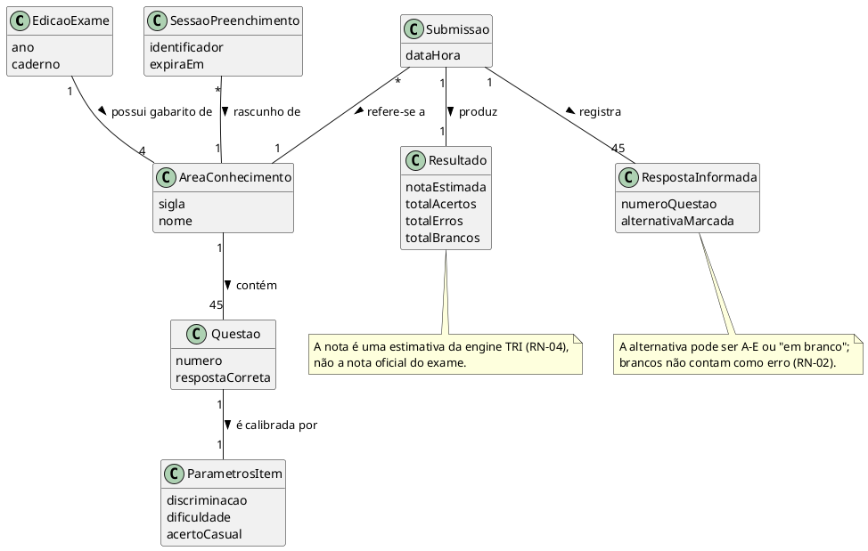
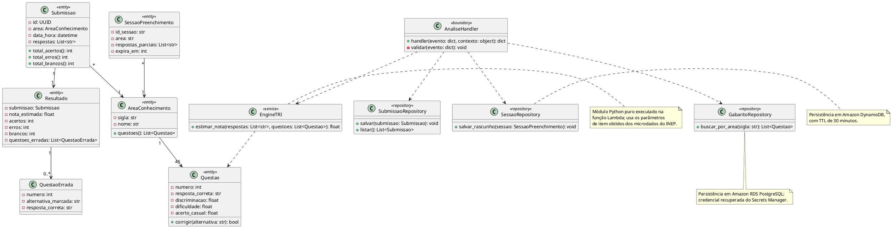

## Diagrama de Classes

### Objetivo

O Diagrama de Classes é uma representação visual das classes, seus atributos, métodos e os relacionamentos entre elas. Ele é fundamental para a modelagem orientada a objetos e serve como base para a implementação do sistema.

### Componentes do Diagrama de Classes

Este documento apresenta, para o projeto Apollo:

1. **Diagrama de Classes Conceitual** (visão de domínio).  
2. **Diagrama de Classes de Especificação** (visão de projeto).  

Ambos foram derivados de:

- Casos de uso ([casos_de_uso.md](casos_de_uso.md));
- Documento de levantamento de requisitos ([levreq.md](levreq.md));
- Documento de Visão ([documento_de_visao.md](../Iniciacao/documento_de_visao.md)), em especial a descrição dos dados mantidos no Amazon RDS e no Amazon DynamoDB;
- Telas previstas para o formulário e para o resultado.

> **Observação sobre a origem do modelo.** Os documentos-fonte do projeto (Documento de Visão e Requisitos Suplementares) não especificam um modelo de dados. As classes a seguir foram derivadas das entidades explicitamente citadas nesses documentos — gabarito por área, questões com resposta correta e parâmetros de item, sessão temporária de preenchimento, submissão e resultado. O modelo deve ser validado com a equipe antes da fase de Construção.

### Fontes de entrada obrigatórias

- **Levantamento de requisitos**: requisitos funcionais RF01 a RF09 e requisitos não funcionais.
- **Casos de uso**: UC01 (Analisar Gabarito), UC02 (Visualizar Resultado), UC03 (Carregar Gabarito e Parâmetros de Item) e UC04 (Consultar Histórico de Submissões).
- **Diagrama de casos de uso**: escopo e fronteiras do sistema.
- **Telas previstas**: tela de preenchimento e tela de resultado.

### 1) Diagrama de Classes Conceitual

#### 1.1 Finalidade

Representar os conceitos do domínio da análise de gabarito, suas responsabilidades e relacionamentos, sem detalhes de implementação.

#### 1.2 Escopo

- Entidades de negócio: edição do exame, área de conhecimento, questão, submissão e resultado;
- Objetos de valor: resposta informada e parâmetros de item;
- Regras de associação e cardinalidade;
- Restrições de negócio relevantes (RN-01 a RN-04).

#### 1.3 Modelo conceitual

#### 1.4 Rastreabilidade

| Classe Conceitual | Requisito(s) | Caso(s) de Uso | Tela/Protótipo |
|---|---|---|---|
| `EdicaoExame` | RF09 | UC03 | — (dado fixo, sem seletor na interface) |
| `AreaConhecimento` | RF01, RF09 | UC01, UC03 | Tela de preenchimento |
| `Questao` | RF04, RF06, RF09 | UC01, UC03 | Tela de resultado |
| `ParametrosItem` | RF04, RF09 | UC01, UC03 | — (uso interno da engine TRI) |
| `RespostaInformada` | RF02 | UC01 | Tela de preenchimento |
| `SessaoPreenchimento` | RF03 | UC01 | Tela de preenchimento |
| `Submissao` | RF07, RF08 | UC01, UC04 | — (consulta administrativa) |
| `Resultado` | RF04, RF05, RF06 | UC01, UC02 | Tela de resultado |

#### 1.5 Critérios de validação

- Cada classe possui vínculo com ao menos um requisito e um caso de uso, conforme a tabela de rastreabilidade;
- O modelo conceitual não inclui classes técnicas (repositórios, controladores, adaptadores de serviço AWS);
- A terminologia acompanha o domínio do ENEM: área de conhecimento, questão, gabarito, parâmetros de item.

### 2) Transição para Diagrama de Classes de Especificação

#### 2.1 Objetivo

Refinar o modelo conceitual para uma estrutura orientada à implementação em Python, considerando a divisão entre a API administrativa em Django REST Framework (Amazon EC2) e a função de análise em AWS Lambda.

#### 2.2 Regras de refinamento aplicadas

- As entidades persistidas no Amazon RDS foram convertidas em classes `<<entity>>` com tipos definidos;
- A sessão temporária foi mantida como classe própria, refletindo o armazenamento no Amazon DynamoDB com TTL;
- A lógica de estimativa foi isolada em `<<service>>`, correspondendo ao módulo Python puro executado na Lambda;
- A fronteira do sistema foi representada pelo manipulador da função Lambda acionado pelo API Gateway;
- A rastreabilidade com requisitos e casos de uso foi preservada.

#### 2.3 Itens esperados por classe

Para cada classe do modelo de especificação são definidos nome, atributos com tipo e visibilidade, operações principais, responsabilidade e relacionamentos, conforme o diagrama a seguir.

### 3) Diagrama de Classes de Especificação

#### 3.1 Conteúdo mínimo

- Classes de domínio (`AreaConhecimento`, `Questao`, `Submissao`, `Resultado`, `SessaoPreenchimento`) e de apoio (`QuestaoErrada`);
- Serviço de estimativa (`EngineTRI`) e fronteira da função Lambda (`AnaliseHandler`);
- Repositórios que isolam o acesso ao Amazon RDS e ao Amazon DynamoDB;
- Multiplicidades e navegabilidade coerentes com as regras de negócio RN-01 a RN-04.

#### 3.2 Rastreabilidade

| Classe de Especificação | Origem Conceitual | Requisito(s) | Caso(s) de Uso |
|---|---|---|---|
| `AreaConhecimento` | `AreaConhecimento` | RF01 | UC01 |
| `Questao` | `Questao` + `ParametrosItem` | RF04, RF06, RF09 | UC01, UC03 |
| `SessaoPreenchimento` | `SessaoPreenchimento` | RF03 | UC01 |
| `Submissao` | `Submissao` + `RespostaInformada` | RF02, RF07 | UC01, UC04 |
| `Resultado` / `QuestaoErrada` | `Resultado` | RF05, RF06 | UC01, UC02 |
| `EngineTRI` | — (serviço derivado do requisito de cálculo) | RF04 | UC01 |
| `AnaliseHandler` | — (fronteira do endpoint serverless) | RF04, RF05 | UC01 |
| `GabaritoRepository` | `Questao` | RF04, RF09 | UC01, UC03 |
| `SubmissaoRepository` | `Submissao` | RF07, RF08 | UC01, UC04 |
| `SessaoRepository` | `SessaoPreenchimento` | RF03 | UC01 |

#### 3.3 Critérios de qualidade

- Cobertura dos requisitos funcionais RF01 a RF09;
- Separação entre estimativa (`EngineTRI`) e persistência (repositórios), mantendo a engine independente de infraestrutura e testável isoladamente;
- Nomes consistentes com o domínio do ENEM e com os demais artefatos do projeto;
- Nenhuma classe sem responsabilidade definida.

### 4) Estrutura de versionamento e revisão

- **Versão**: `v1.0`
- **Data**: 2026
- **Autor(es)**: Equipe Apollo (`<a definir>`)
- **Revisor(es)**: `<a definir>`
- **Resumo da alteração**: modelagem conceitual e de especificação derivada dos requisitos e casos de uso do projeto Apollo.

### 5) Entregáveis

- Diagrama de Classes Conceitual (fonte PlantUML incorporada nesta página);
- Diagrama de Classes de Especificação (fonte PlantUML incorporada nesta página);
- Tabelas de rastreabilidade preenchidas;
- Registro de validação do modelo com a equipe e com o professor orientador — **pendente**.
