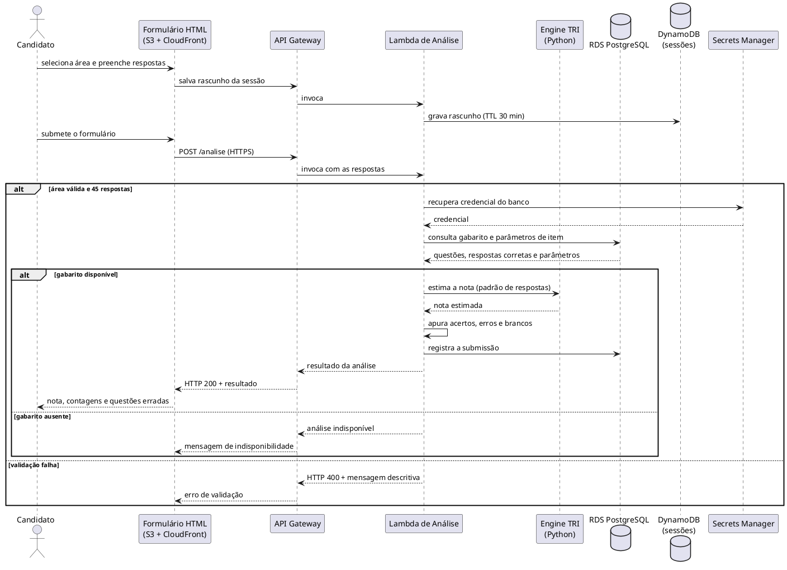

### Diagrama de Sequência

O Diagrama de Sequência é uma representação visual que mostra a interação entre objetos ou componentes ao longo do tempo. Ele é usado para modelar o comportamento dinâmico de um sistema, ilustrando como os objetos colaboram para realizar uma funcionalidade específica.	

#### Objetivo

Registrar a interação entre os componentes da arquitetura AWS do projeto Apollo para o caso de uso principal, garantindo rastreabilidade com:

- Casos de Uso
- Diagrama de Casos de Uso
- Documento de Levantamento de Requisitos
- Documento de Visão (arquitetura da solução)

#### Instruções de Preenchimento

1. Selecione um Caso de Uso prioritário.
2. Identifique os requisitos funcionais e regras de negócio relacionados.
3. Mapeie as telas/fluxos previstos para o caso de uso.
4. Modele a interação entre ator(es), fronteira, controle e entidade.
5. Valide consistência com o fluxo principal e fluxos alternativos.

---

#### Diagrama de Sequência — UC01: Analisar Gabarito

##### 1. Identificação

- **Caso de Uso:** Analisar Gabarito
- **ID do Caso de Uso:** UC01
- **Ator(es):** Candidato
- **Prioridade:** Alta
- **Responsável:** `<a definir>`
- **Data:** 2026

##### 2. Referências

- **Requisitos relacionados (ID):** RF01, RF02, RF03, RF04, RF05, RF06, RF07; RNF-PER-01, RNF-SEG-01, RNF-USA-03
- **Diagrama de Caso de Uso:** [casos_de_uso.md](casos_de_uso.md)
- **Telas previstas:** tela de preenchimento e tela de resultado (ver [levreq.md](levreq.md), seção 5)
- **Regra(s) de negócio associada(s):** RN-01, RN-02, RN-03, RN-04

##### 3. Cenário Modelado

- **Objetivo do cenário:** obter a nota estimada e o detalhamento das questões erradas de uma área de conhecimento a partir das respostas informadas pelo candidato.
- **Pré-condições:** gabarito e parâmetros de item da área carregados no Amazon RDS; frontend publicado no S3 e distribuído pelo CloudFront.
- **Pós-condições:** resultado apresentado ao candidato e submissão registrada no histórico.
- **Gatilho de início:** o candidato envia o formulário preenchido.

##### 4. Participantes (Lifelines)

- **Ator:** Candidato
- **Boundary (Interface/Tela):** Formulário HTML estático (Amazon S3 + Amazon CloudFront)
- **Control (Orquestração):** Amazon API Gateway e função AWS Lambda de análise
- **Entity (Dados/Serviços):** Amazon RDS PostgreSQL (gabarito, parâmetros de item e histórico), Amazon DynamoDB (sessão temporária) e engine TRI (módulo Python executado na Lambda)
- **Sistemas externos:** AWS Secrets Manager (credencial do banco) e Amazon CloudWatch (registro de logs)

##### 5. Fluxo Principal (mensagens)

| Passo | Remetente | Destinatário | Mensagem/Ação | Tipo (sync/async/retorno) |
|------:|-----------|--------------|---------------|----------------------------|
| 1 | Candidato | Formulário HTML | Seleciona a área e preenche as respostas | sync |
| 2 | Formulário HTML | API Gateway → Lambda | Envia o rascunho parcial da sessão | async |
| 3 | Lambda | DynamoDB | Grava o rascunho com TTL de 30 minutos | sync |
| 4 | Candidato | Formulário HTML | Submete o formulário | sync |
| 5 | Formulário HTML | API Gateway | `POST` das respostas da área selecionada (HTTPS) | sync |
| 6 | API Gateway | Lambda | Invoca a função de análise com o payload recebido | sync |
| 7 | Lambda | Lambda | Valida a área e a quantidade de respostas (RN-01) | sync |
| 8 | Lambda | Secrets Manager | Recupera a credencial do banco | sync |
| 9 | Lambda | RDS PostgreSQL | Consulta gabarito e parâmetros de item da área | sync |
| 10 | RDS PostgreSQL | Lambda | Retorna as 45 questões com resposta correta e parâmetros | retorno |
| 11 | Lambda | Engine TRI | Solicita a estimativa da nota a partir do padrão de respostas (RN-04) | sync |
| 12 | Engine TRI | Lambda | Retorna a nota estimada | retorno |
| 13 | Lambda | Lambda | Apura acertos, erros e brancos e monta a lista de questões erradas (RN-02) | sync |
| 14 | Lambda | RDS PostgreSQL | Registra a submissão no histórico | sync |
| 15 | Lambda | CloudWatch | Registra os logs da execução | async |
| 16 | Lambda | API Gateway | Retorna o resultado da análise | retorno |
| 17 | API Gateway | Formulário HTML | Devolve a resposta HTTP 200 com o resultado | retorno |
| 18 | Formulário HTML | Candidato | Apresenta nota estimada, contagens e questões erradas | retorno |

##### 6. Fluxos Alternativos e Exceções

| ID | Condição | Descrição do fluxo | Impacto |
|----|----------|--------------------|---------|
| A1 | Sessão temporária expira antes da submissão | O TTL do DynamoDB remove o rascunho automaticamente; o candidato preenche o formulário novamente | Perda apenas do rascunho; nenhuma submissão é afetada |
| A2 | Candidato deixa questões em branco | As questões em branco são contabilizadas separadamente e não são tratadas como erro (RN-02) | Resultado apresenta acertos, erros e brancos distintamente |
| E1 | Área não informada ou quantidade de respostas diferente de 45 | A função Lambda interrompe o processamento no passo 7 e retorna HTTP 400 com mensagem descritiva | Análise não é realizada; nenhum registro é gravado |
| E2 | Gabarito ou parâmetros de item ausentes para a área | A consulta do passo 9 não retorna dados; a Lambda interrompe a execução e informa a indisponibilidade da análise | Demonstração bloqueada até a execução do script de seed |
| E3 | Falha de comunicação com o RDS ou com o Secrets Manager | A Lambda retorna HTTP 500 com mensagem genérica e registra o erro no CloudWatch (RNF-USA-03) | Erro contabilizado pelo alarme de taxa de erro da Lambda |

##### 7. Regras de Negócio Aplicadas

- **RN-01:** cada análise corresponde a uma única área de conhecimento e a exatamente 45 respostas.
- **RN-02:** questões em branco são contabilizadas em categoria própria, distinta de acertos e de erros.
- **RN-03:** o rascunho da sessão é temporário e expira automaticamente após 30 minutos.
- **RN-04:** a nota é uma estimativa produzida pela engine TRI a partir do gabarito oficial e dos parâmetros de item do INEP; não corresponde à nota oficial do exame.

##### 8. Pontos de Validação

- [x] Fluxo compatível com o Caso de Uso UC01
- [x] Mensagens consistentes com os requisitos funcionais RF01 a RF07
- [x] Alternativas e exceções representadas
- [x] Participantes aderentes à arquitetura descrita no Documento de Visão
- [x] Correspondência com as telas previstas no levantamento de requisitos

##### 9. Artefatos

- **Fonte do diagrama (PlantUML):** bloco `plantuml` abaixo, renderizado nesta página
- **Versão:** 1.0

---

#### Diagrama (PlantUML)



#### Estrutura textual mínima

```text
Candidato preenche o formulário na tela de análise
Formulário envia as respostas ao API Gateway via HTTPS
API Gateway invoca a função Lambda de análise
Lambda valida a área e a quantidade de respostas (RN-01)
Lambda consulta o gabarito e os parâmetros de item no RDS
Engine TRI estima a nota a partir do padrão de respostas (RN-04)
Lambda apura acertos, erros e brancos (RN-02) e registra a submissão
Lambda responde ao API Gateway, que devolve o resultado ao formulário
Formulário apresenta o resultado ao Candidato
```

#### Versionamento

| Data | Versão | Descrição | Autor(es) |
| -- | -- | -- | -- |
| 2026 | 1.0 | Modelagem do caso de uso UC01 sobre a arquitetura AWS do projeto Apollo. | Equipe Apollo (`<a definir>`) |
